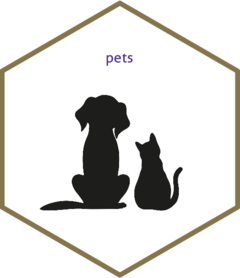

<!-- README.md is generated from README.Rmd. Please edit that file -->

```{r, include = FALSE}
knitr::opts_chunk$set(
  collapse = TRUE,
  comment = "#>",
  fig.path = "man/figures",
  out.width = "100%"
)
```

# pets 

<!-- badges: start -->
<!-- badges: end -->

The goal of pets is to provide a simple means for people to express their feelings about pets. At present, the package only contains one function: `cats()`.

## Installation

You can install the development version from [GitHub](https://github.com/) with:

``` r
# install.packages("devtools")
devtools::install_github("mdscheuerell/pets")
```

## Example

Here are two simple examples that allow you to express your feelings about cats:

```{r example}
library(pets)

## if you like cats
cats(TRUE)

## if you don't like cats
cats(FALSE)
```

